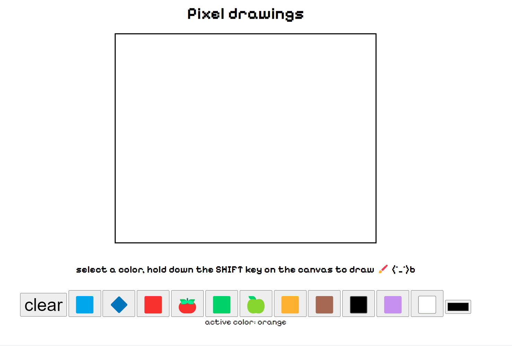

## simple DOM manipulation
---
#### This method uses a loops `<divs>` and a hover (which is very inefficient), for version 2.0 I would refactor to build a 2d array and color based on the index, which would allow color fill
